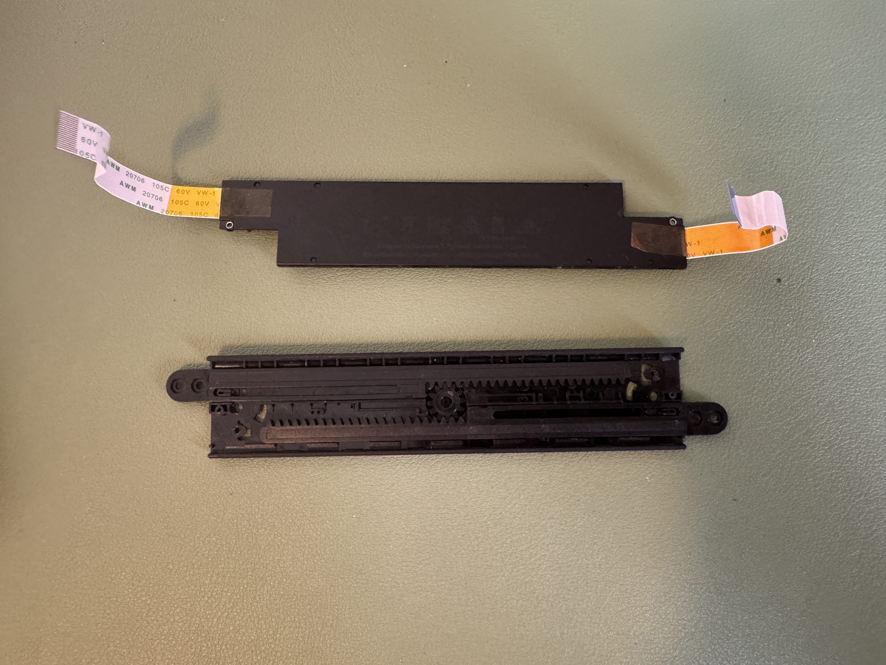

 

  

  <h3 align="center">Backbone One iPad Mini Upgrade</h3>

  

    Expansion upgrade for the Gen 4 Backbone One to fit larger devices and tablets, including iPad mini.
     
     
  

    

## Table Of Contents

* [About the Mod](#about-the-mod)
* [Getting Started](#getting-started)
  * [Prerequisites](#prerequisites)
  * [Quick Disclaimer](#quick-disclaimer)
* [The Mod](#the-mod)
* [Author](#author)

## About The mod

Imagine my frustration when purchasing the Backbone One to realize it needed to extend only 20mm more to accommodate an iPad mini. <b>20mm!</b> So close! This 3D printed solution aims to remedy my aching heart for something like a `*cough*` Playstation Portal, without denting my wallet.

There are other iPad mini accommodating solutions for the Backbone out there. But none of them met my strict guidelines: <i>avoid heavy modification, no visible wires, absolutely no ugly tape wrapped around the back, and retain original spring functionality.</i> I also wanted it to fit within the travel case...

I'm happy to report all of these guidelines were met with this mod. In total, this project should take you about 2 hours. ← That includes the 3D printing time as well!

If you found this mod helpful at all, please consider [tipping to support development](https://www.paypal.com/donate/?business=V2MLZ6NSZ3BUQ&amount=&no_recurring=0&item_name=points+for+you%2C+support+for+me&currency_code=USD) for this mod and others! 

## Getting Started

For this project, I am modding the USB-C Gen 4 (2023) version of the Backbone One. <i>Compatibility with older generations is not guaranteed since I do not have those versions to examine and test with.</i>

### Prerequisites

Start by 3D printing the 4 new parts, as this will take the most time:
I recommend a fine print with a completely solid infill.
<ul>
<li>Extended-BackBoneOne4_V5a-Top.stl</li>
<li>Extended-BackBoneOne4_V5a-Bottom.stl</li>
<li>Left/Right Support Brackets</li>
</ul>

### Quick Disclaimer

The delicate ribbon cable connecting the two controllers is known to break under constant stress. Expanding the Backbone wider than intended is indeed considered "stress." In my testing, I measured two Backbone units and noticed the cable length on the left controller was longer than the length given to the right. This discovery is what made this mod possible. I recommend checking the length of cable before proceeding. <b>If, for example, your cable is instead longer on the right: Flip the top and bottom pieces (if your OCD can handle that). If your cable is even, then only print two of the "Bottom" parts.</b>

<I>I'm sorry, but going forward I'm legally required to say "Proceed at your own risk." and "I am not responsible for any potential damage that may occur to your product"... and other legal jargon.</I>

### The Mod

## Step 1

Open the backbone controller by unscrewing the 8 screws at the back. Once opened, carefully disconnect the ribbon cables from both sides, and the USB-C connector from the right side.
Once opened, it should look like this:
  

## Step 2

Carefully remove the tension from the springs on both sides. Unscrew both and set aside.
  
 

## Step 3

Locate and remove the magnetic support bracket just below the USB-C connector cable. There are two screws to remove this support.
  
 

Unscrew the 4 screws holding the support rails on each side. Then slide out each side, be mindful of the ribbon cable.
  
 

## Step 4

Remove the two screws holding the rail together. Once removed, carefully pry the rail apart.
  
  

## Step 5

Remove the two gear tracks and <i>be sure to save these if you want to revert the mod in the future.</i> Replace with the newly 3D printed Top and Bottom pieces.
  

## Step 6

Snap the rail back together and insert the two screws. Feed the ribbon cables through the Left and Right sides.
Insert only one screw in the inward hole (pictured below). Make sure to tighten but no over tighten. This will allow the supports to further extend.
Set aside and save the two remaining/extra screws </i>if you want to revert the mod in the future.</i>
  
 

## Step 7

Reassemble the springs and position them into place. <b>OPTIONAL:</b> For added support, you can 3D print the two L/R support pieces. These will help the backbone retain some rigidity while fully extended. <i>Optional, but highly recommend.</i> Repeat for the Left side.
  
  

## Step 8

Reattach the magnetic support that was removed from [step 3](#step-3).
  

## Step 9

Carefully reattach the ribbon cables to the left and right controllers. Reattach the USB-C connector on the right controller as well. This is what the finished Left and Right side should look like:
  
 

<b>Before moving forward,</b> take a moment to carefully and slowly test your expansion range. <i>Be carefull of the springs as they can easily jump out of place.</i> If you notice any strain or issues with the ribbon cable, <b>do not move forward and assess your options mentioned in the disclaimer above.</b> Trust me, last thing you want to do is damage these ribbon cables. Finding replacements will be tough.

## Step 10

After confirming support and everything is working nicely. Insert the 8 screws on the back of the BackBone. Once reassembled, be sure to carefully and slowly test the rail and expanded size. If you notice any unusual tension, go back to [step 5](#step-5) & [step 6](#step-6) and make sure the ribbon cables aren’t stuck or twisted in any way.

## Step 11 

🎉 That’s it! Notice the main difference is the expanded size when collapsed. However, this mod will still allow the BackBone to be stored in the original case!
  
  

If you found this mod helpful at all, please consider [tipping to support development](https://www.paypal.com/donate/?business=V2MLZ6NSZ3BUQ&amount=&no_recurring=0&item_name=points+for+you%2C+support+for+me&currency_code=USD) for this mod and others! 

## Author

* **Jon Ochocki** - [Jon Ochocki](https://jonlebron.com)
